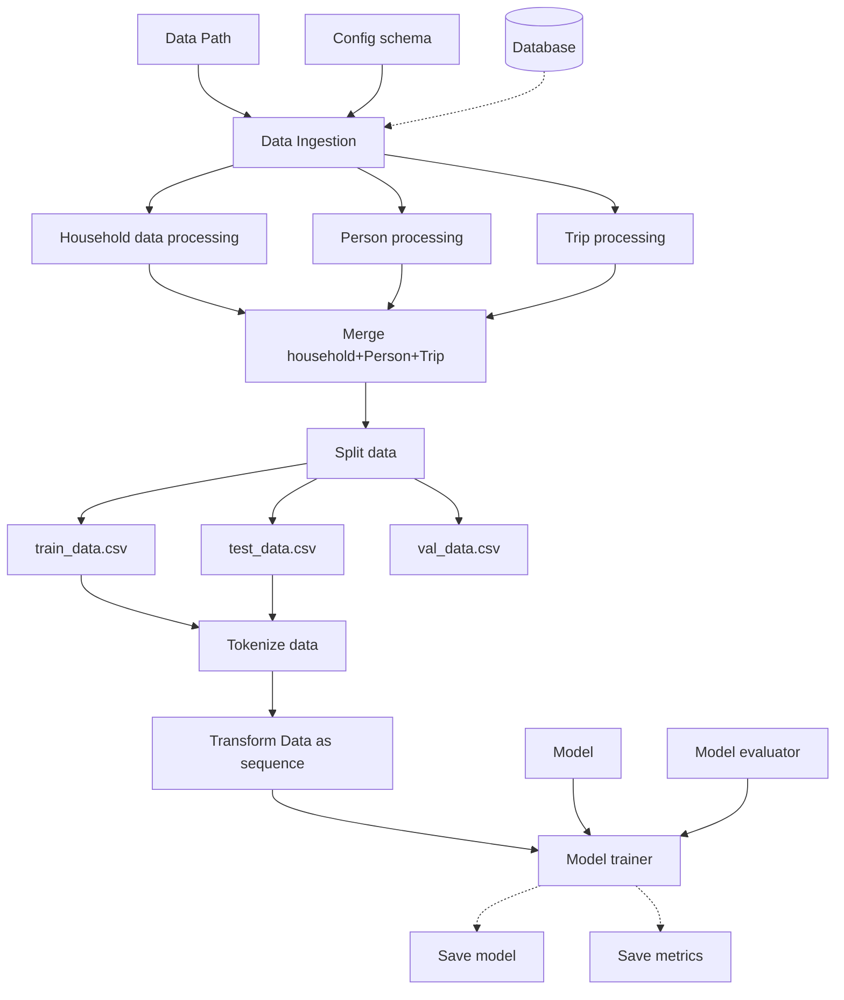

## Repository Information

### Training flow

```mermaid
flowchart TD
    A[Data Path] --> B[Data Ingestion]
    C[Config schema] --> B
    D[(Database)] -.-> B
    B --> C1[Household data processing]
    B --> C2[Person processing]
    B --> C3[Trip processing]
    C1 --> MERGE1[Merge household+Person+Trip]
    C2 --> MERGE1
    C3 --> MERGE1
    MERGE1 --> SPLIT[Split data]
    SPLIT --> F1[train_data.csv]
    SPLIT --> F2[test_data.csv]
    SPLIT --> F3[val_data.csv]
    F1 --> TOKEN[Tokenize data]
    F2 --> TOKEN
    TOKEN --> SEQ[Transform Data as sequence]
    SEQ --> H[Model trainer]
    M1[Model] --> H
    M2[Model evaluator] --> H 
    H -.-> I1[Save model]
    H -.-> I2[Save metrics]
```

### Generataion flow
```mermaid
flowchart TD
    
```