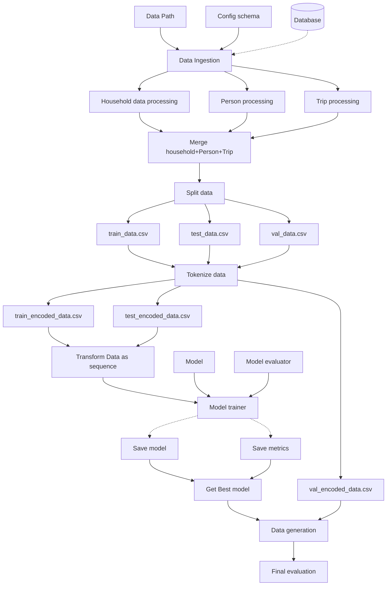

## Repository Information

### Training flow

```mermaid
flowchart TD
    A[Data Path] --> B[Data Ingestion]
    C[Config schema] --> B
    D[(Database)] -.-> B
    B --> C1[Household data processing]
    B --> C2[Person processing]
    B --> C3[Trip processing]
    C1 --> MERGE1[Merge household+Person+Trip]
    C2 --> MERGE1
    C3 --> MERGE1
    MERGE1 --> SPLIT[Split data]
    SPLIT --> F1[train_data.csv]
    SPLIT --> F2[test_data.csv]
    SPLIT --> F3[val_data.csv]
    F1 --> TOKEN[Tokenize data]
    F2 --> TOKEN
    F3 --> TOKEN
    TOKEN --> ENCODED1[train_encoded_data.csv]
    TOKEN --> ENCODED2[test_encoded_data.csv]
    TOKEN --> ENCODED3[val_encoded_data.csv]
    ENCODED1 --> SEQ[Transform Data as sequence]
    ENCODED2 --> SEQ
    SEQ --> H[Model trainer]
    M1[Model] --> H
    M2[Model evaluator] --> H 
    H -.-> I1[Save model]
    H -.-> I2[Save metrics]
    I1 --> BEST_MODEL[Get Best model]
    I2 --> BEST_MODEL
    BEST_MODEL --> GEN_DATA[Data generation]
    ENCODED3 --> GEN_DATA
    GEN_DATA --> FINAL_EVAL[Final evaluation]
```
